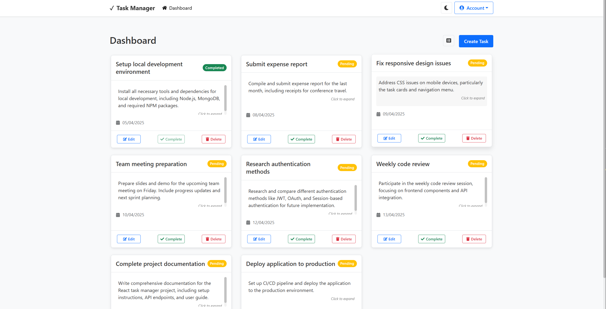
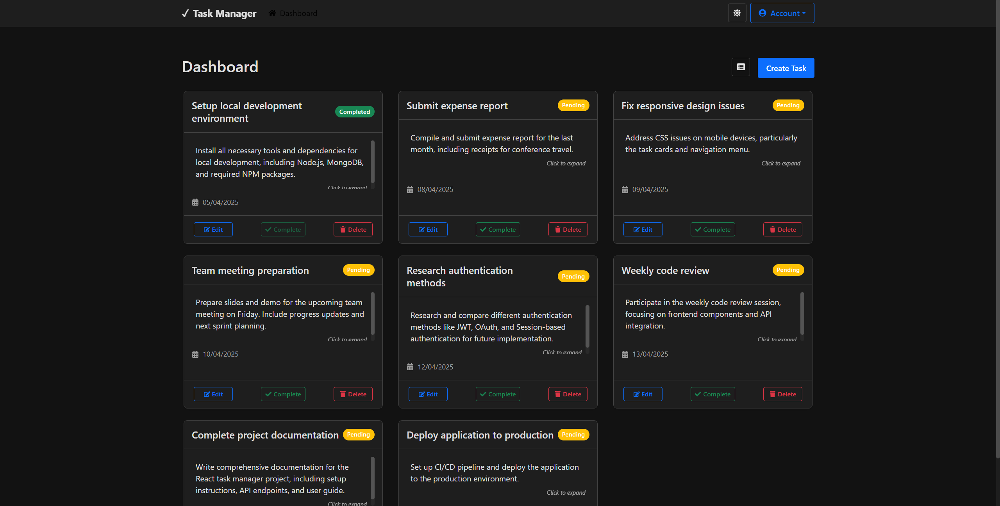

# TaskFlow: A Full-Stack Task Manager

TaskFlow is a modern, full-stack task management application designed to help users organize their tasks efficiently. With features like **user authentication**, **dark mode**, and **real-time updates**, TaskFlow provides a seamless experience for managing tasks.

## Features

- **User Authentication**: Secure signup and login with JWT (JSON Web Tokens).
- **Dark Mode**: Toggle between light and dark themes for a personalized experience.
- **Task Management**: Create, edit, delete, and mark tasks as complete.
- **Responsive Design**: Works seamlessly on desktop, tablet, and mobile devices.
- **Real-Time Updates**: Tasks are updated in real-time without refreshing the page.
- **Inactivity Logout**: Automatically logs out users after 30 minutes of inactivity.

## Technologies Used

- **Frontend**: React, React Bootstrap, React Router, Axios
- **Backend**: Node.js, Express, MongoDB, Mongoose
- **Authentication**: JSON Web Tokens (JWT)
- **Deployment**: Vercel (Frontend), Render (Backend)

## Live Demo

Check out the live demo of TaskFlow:  
[TaskFlow Live Demo](http://147.93.94.250/taskflow/))

## Screenshots

### Light Mode


### Dark Mode


## Installation

To run TaskFlow locally, follow these steps:

### Prerequisites

- Node.js (v16 or higher)
- MongoDB (or MongoDB Atlas for cloud database)

### Backend Setup

1. Clone the repository:
   ```bash
   git clone https://github.com/<your-username>/taskflow.git
   cd taskflow/backend

2. Install dependencies:
   ```npm install```

3. Create a .env file in the backend folder and add your environment variables:

   ```MONGO_URI=mongodb+srv://<username>:<password>@cluster0.mongodb.net/task-manager?retryWrites=true&w=majority
   JWT_SECRET=your_jwt_secret
   PORT=5000

4. Start the backend server:

   ```npm start

Frontend Setup

1. Navigate to the frontend folder:

   ```cd ../frontend

2. Install dependencies:

   ```npm install

3. Start the frontend development server:

   ```npm start

4. Open your browser and visit http://localhost:3000.

Contact
If you have any questions or feedback, feel free to reach out:

Email: ayatgimenez@hotmail.com

LinkedIn: [Hicham AYAT GIMENEZ](https://www.linkedin.com/in/hicham-a-9553ba28b/)

Portfolio: [Portfolio Website](https://shizukadesu.com/)

Made with ❤️ by Shizuka
